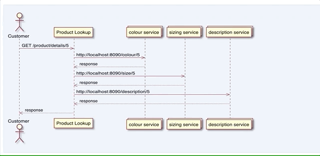

# Yatspec Example <sup>[](https://circleci.com/gh/nickmcdowall/yatspec-example)</sup>

This is an example Gradle project that uses Yatspec ([nickmcdowall fork](https://github.com/nickmcdowall/yatspec))
to generate the test reports (including sequence diagram).

See `SequenceDiagramExampleTest.java`for a JUnit 5 test skeleton example.

Run the tests the usual way by building the project e.g.:

### Prerequisites:
* Java 11

### Run

```bash
./gradlew clean build
```

### HTML Report
For reports generated by gradle navigate to: '`$buildDir/reports/yatspec`'

The generated sequence diagram will look like this. Note that hovering over the 
responses will show the captured json messages.


