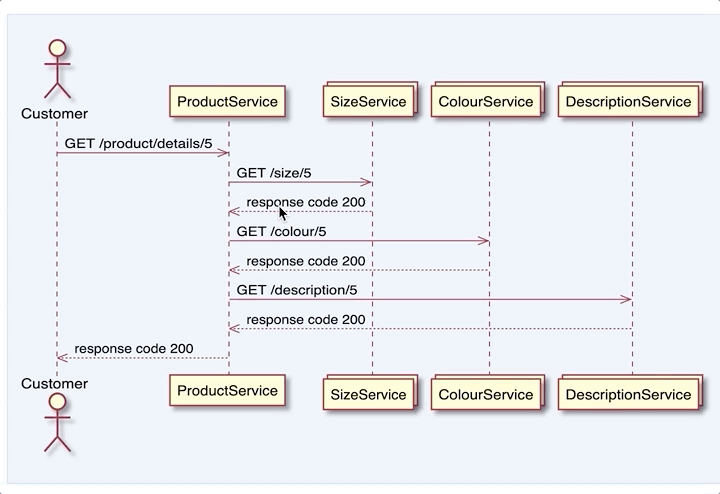

# Yatspec Example <sup>[](https://circleci.com/gh/nickmcdowall/yatspec-example)</sup>

This is an example Gradle project that uses Yatspec ([nickmcdowall fork](https://github.com/nickmcdowall/yatspec))
to generate the test reports (including sequence diagram).

See `SpringBootSequenceExampleTest.java` for an example of how to configure 
a test to generate a sequence diagram.

### Prerequisites:
* Java 11

### Run
Run the tests via your IDE or using gradle wrapper e.g.:

```bash
./gradlew clean build
```

### HTML Report
For reports generated by gradle navigate to: '`$buildDir/reports/yatspec`'

The generated sequence diagram will look something like this. 
Note that hovering over the responses will show the captured json messages.


